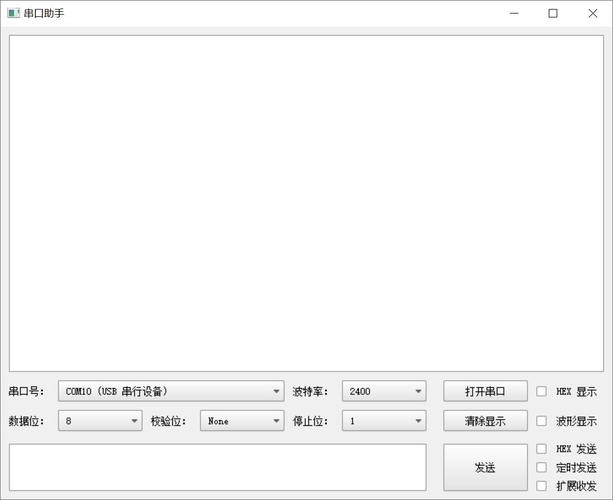
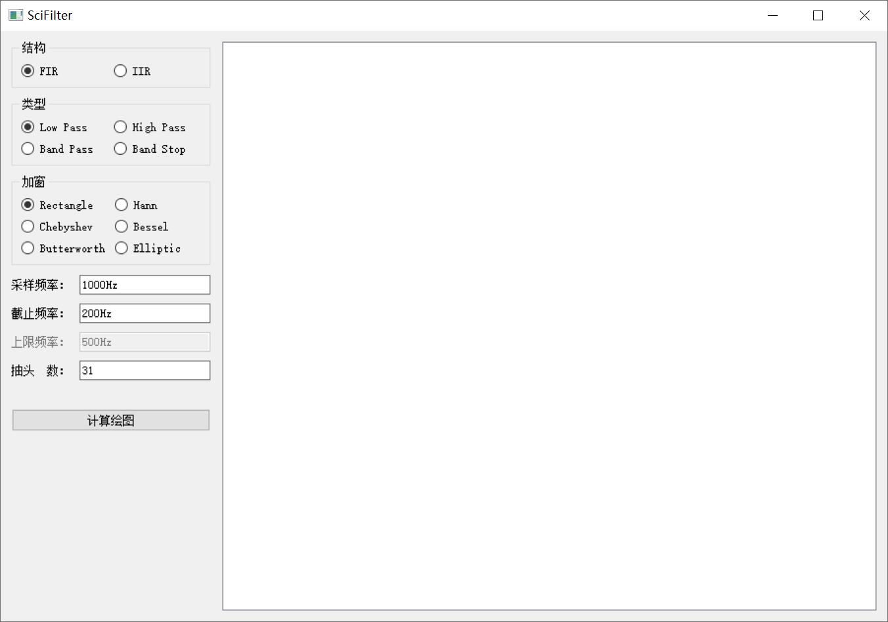
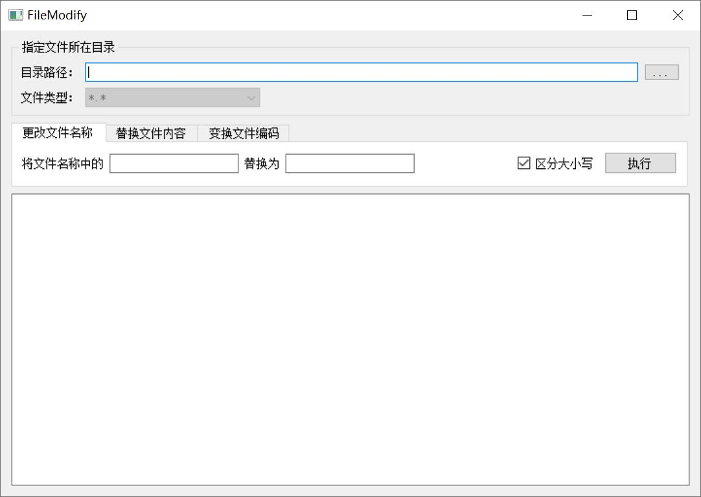

# PYQTool
Some useful tool written in Python and PyQt.

## QmlSer
serial assistant written in python and qml.

## 7SegLED

## ResColor

## SciFilter
filter designer based on scipy.

## FileModify

